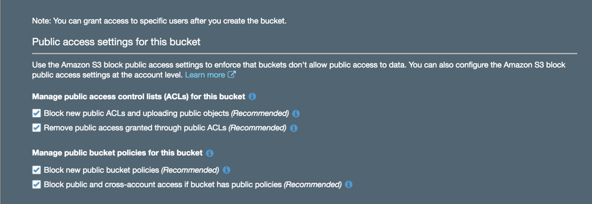
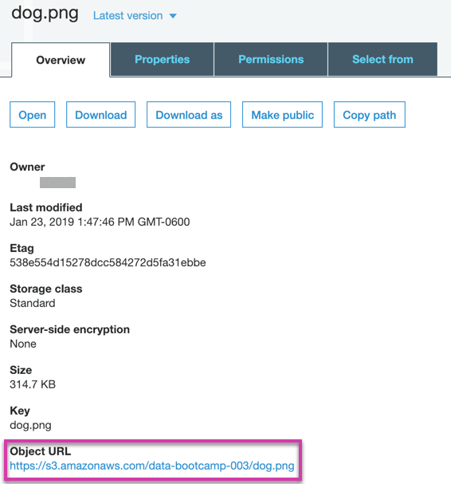
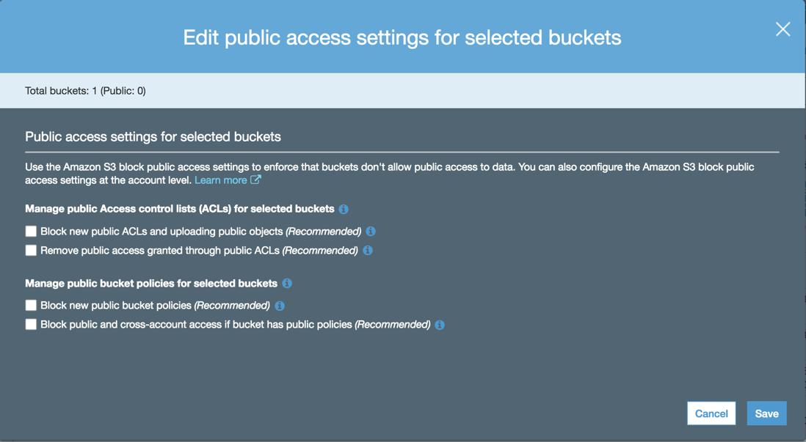

# Amazon Web Services Free Tier
Amazon Web Services (AWS) has three types of free offers available depending on the product that you choose: free tier, 12 months free, and trials. The details of each free offer can be found here: https://aws.amazon.com/free/free-tier/.

All activities in the Big Data unit will use free tier services. However, it is still possible to [incur charges](https://aws.amazon.com/getting-started/hands-on/control-your-costs-free-tier-budgets/) while using the free tier service. Therefore, before you sign up and use any AWS Free Tier service, make sure you review all the services and resources covered under [AWS Free Tier](https://aws.amazon.com/free/). AWS provides additional information on how to avoid free tier charges [here](https://aws.amazon.com/getting-started/hands-on/control-your-costs-free-tier-budgets/).

# Cloud Storage on S3

* Go to **console.aws.amazon.com**. The top left of the page there should be **Services** carrot.
  * Select **S3** under **Storage**.

* Click **Create bucket**.

* Create a bucket name of your choice and choose the region.

* **Please Note:** The bucket name must be unique across all existing bucket names in Amazon S3. Buckets cannot be renamed or created inside of another bucket.

* Leave the region as the default, e.g. `US East (Ohio)`. Changing the region will change the object URL used in all examples today.

* Most of the options on the **Configure Options** page can be left as default values.

* **Tags** are user-defined key-value pairs of information that can help keep track of buckets.

* Click **Next**.

* The **Set Permissions** page is where we grant others permission to access buckets.

  * A number of [security breaches](https://securityboulevard.com/2018/01/leaky-buckets-10-worst-amazon-s3-breaches/) were caused by unsecured S3 buckets.
  
  * Public access is denied by default.

  * Leave the boxes checked and click **Next**.

    

* The **Review** page is a summary of the bucket configurations. Click **Create bucket**. The bucket name now appears in the S3 console.

    

    

* You can now upload your documents. Click the bucket name and then click **Upload**.

  * A file can be dragged to the screen.

  * Click **Upload**.

    
    

  * Click the filename.

    

  * Clicking the link leads to an error message! Why?

    

    

  * By default, the permission for the file denies access to everyone, so it needs to be changed.

  * Navigate back to the dashboard by clicking **Amazon S3** on the top left.

    

  * Check the box next to your bucket and click **Edit public access settings**.

    

  * Make sure all boxes are unchecked on the next screen. Even though these were checked in the initial setup, they will not be now.

    

  * Click **Save**. Then type **confirm** and click **Confirm**.

    

    * The object should now be accessible by all.

* **Note:** You can remove public access anytime by repeating the steps above and checking all the boxes in **Edit public access settings**.
